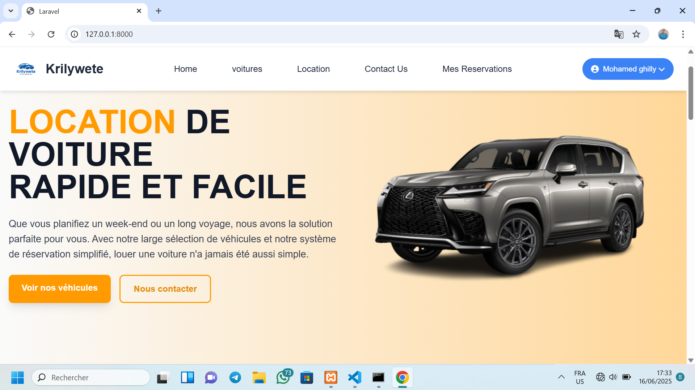
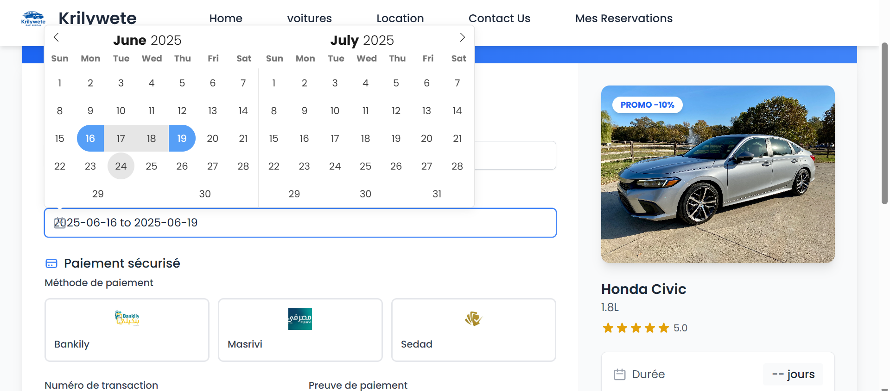
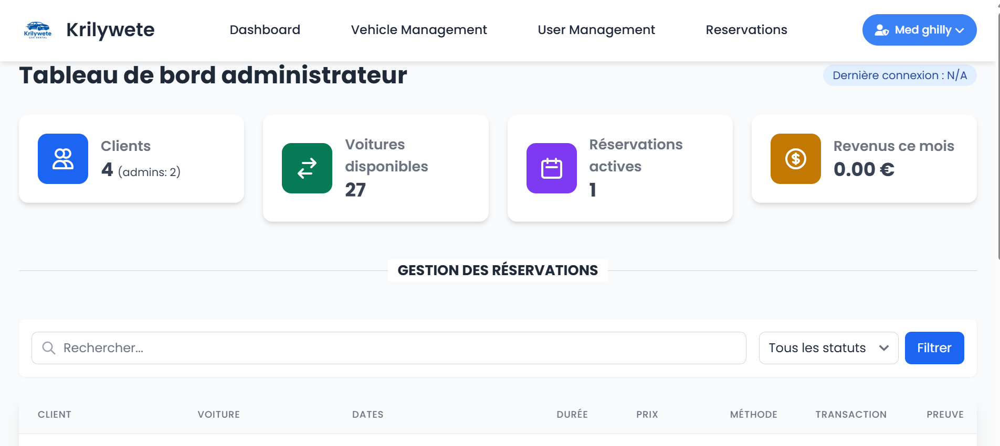
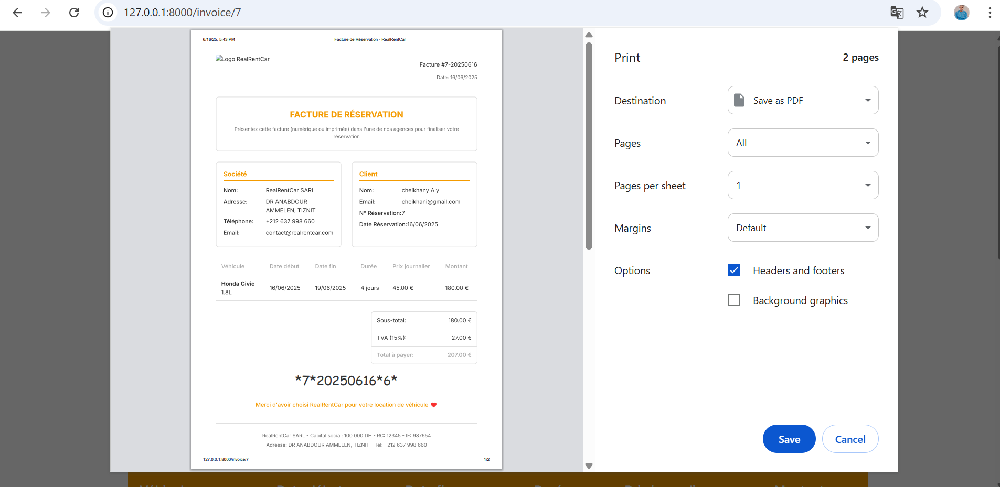
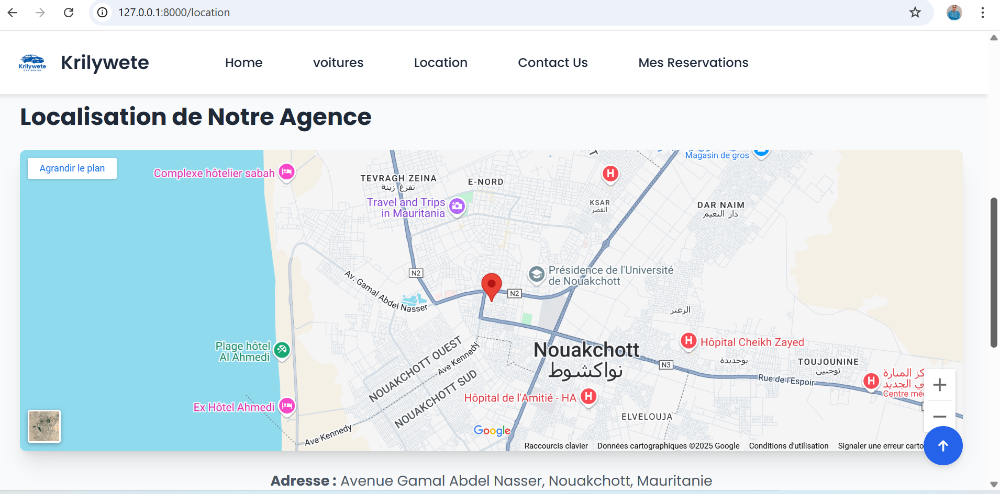

<div align="center">


# 🚗 Krilywete — Car Rental Management System

**Système de location de voitures moderne, rapide et sécurisé**

[](https://laravel.com)
[](https://php.net)
[](https://tailwindcss.com)
[](https://www.mysql.com)
[](https://vitejs.dev)
[](LICENSE)

</div>

---

## 📋 Table des matières / Table of Contents

- [Aperçu / Overview](#-aperçu--overview)
- [Fonctionnalités / Features](#-fonctionnalités--features)
- [Captures d'écran / Screenshots](#-captures-décran--screenshots)
- [Stack Technique / Tech Stack](#-stack-technique--tech-stack)
- [Architecture de la BDD / Database Schema](#-architecture-de-la-bdd--database-schema)
- [Installation](#-installation)
- [Configuration](#-configuration)
- [Utilisation / Usage](#-utilisation--usage)
- [Structure du projet / Project Structure](#-structure-du-projet--project-structure)
- [Contribuer / Contributing](#-contribuer--contributing)

---

## 🌟 Aperçu / Overview

**Krilywete** est une application web complète de gestion de location de voitures, développée avec **Laravel 10**. Elle offre une interface moderne et intuitive pour les clients souhaitant réserver un véhicule, ainsi qu'un tableau de bord administrateur puissant pour gérer la flotte, les réservations et les paiements.

> **Krilywete** is a full-featured car rental management web application built with **Laravel 10**. It provides a modern, intuitive interface for clients to browse and book vehicles, along with a powerful admin dashboard to manage fleet, reservations, and payments.

---

## ✨ Fonctionnalités / Features

### 👤 Côté Client / Client Side
| Fonctionnalité | Description |
|---|---|
| 🔍 **Catalogue de véhicules** | Parcourir tous les véhicules disponibles avec photos et détails |
| 🔎 **Recherche & Filtres** | Rechercher par marque, modèle ou disponibilité |
| 📅 **Réservation en ligne** | Sélection de dates avec calendrier interactif (Flatpickr) |
| 💳 **Paiement mobile** | Support Bankily, Masrivi, Sedad avec upload de preuve de paiement |
| 📄 **Facture PDF** | Génération automatique de factures PDF téléchargeables |
| 📋 **Suivi des réservations** | Historique complet de toutes les réservations |
| 👤 **Profil utilisateur** | Gestion du compte et avatar |

### 🔧 Côté Administrateur / Admin Side
| Fonctionnalité | Description |
|---|---|
| 📊 **Tableau de bord** | Statistiques en temps réel (revenus, réservations, clients) |
| 🚗 **Gestion de la flotte** | Ajouter, modifier, supprimer des véhicules |
| 📋 **Gestion des réservations** | Voir et mettre à jour le statut des réservations |
| 💰 **Validation des paiements** | Vérifier les preuves de paiement et valider les transactions |
| 👥 **Gestion des utilisateurs** | Voir les profils clients et ajouter des admins |
| 🏷️ **Promotions** | Appliquer des réductions (%) sur les véhicules |

### 🔒 Sécurité / Security
- Authentification séparée pour clients et administrateurs
- Middleware de protection des routes par rôle
- Protection CSRF intégrée
- Validation des données côté serveur
- Limite de 2 réservations actives par utilisateur

---

## 📸 Captures d'écran / Screenshots

### Page d'accueil / Homepage


### Catalogue de véhicules / Car Catalog


### Réservation / Booking


### Tableau de bord admin / Admin Dashboard


### Facture PDF / Invoice


### Localisation de l'agence / Agency Location


---

## 🛠️ Stack Technique / Tech Stack

### Backend
- **[Laravel 10.10](https://laravel.com/)** — Framework PHP full-stack
- **[PHP 8.1+](https://php.net/)** — Langage de programmation
- **[MySQL](https://www.mysql.com/)** — Base de données relationnelle
- **[DOMPDF 2.0](https://github.com/dompdf/dompdf)** — Génération de PDF
- **[Laravel Sanctum](https://laravel.com/docs/sanctum)** — Authentification API
- **[Laravel UI](https://github.com/laravel/ui)** — Scaffolding d'authentification

### Frontend
- **[Tailwind CSS 3.3](https://tailwindcss.com/)** — Framework CSS utility-first
- **[Flowbite 1.6](https://flowbite.com/)** — Composants UI Tailwind
- **[Vite 4.x](https://vitejs.dev/)** — Bundler moderne ultra-rapide
- **[Flatpickr](https://flatpickr.js.org/)** — Sélecteur de dates
- **[Blade](https://laravel.com/docs/blade)** — Moteur de templates
- **[SASS](https://sass-lang.com/)** — Préprocesseur CSS

---

## 🗄️ Architecture de la BDD / Database Schema

```
┌─────────────┐       ┌──────────────────┐       ┌────────────────────┐
│    users    │       │   reservations   │       │       cars         │
├─────────────┤       ├──────────────────┤       ├────────────────────┤
│ id          │──┐    │ id               │    ┌──│ id                 │
│ name        │  └───►│ user_id (FK)     │    │  │ brand              │
│ email       │       │ car_id (FK)      │◄───┘  │ model              │
│ password    │       │ start_date       │       │ engine             │
│ role        │       │ end_date         │       │ price_per_day      │
│ avatar      │       │ days             │       │ image              │
│ timestamps  │       │ total_price      │       │ quantity           │
└─────────────┘       │ status           │       │ status             │
                      │ payment_method   │       │ reduce (%)         │
                      │ payment_status   │       │ stars              │
                      │ transaction_num  │       │ timestamps         │
                      │ payment_screenshot│      └────────────────────┘
                      │ timestamps       │
                      └──────────────────┘
```

**Statuts des réservations / Reservation Statuses:**
```
Pending → Active → Confirmed → Ended
                ↘ Canceled
```

**Méthodes de paiement / Payment Methods:** Bankily · Masrivi · Sedad

---

## 🚀 Installation

### Prérequis / Prerequisites
- PHP >= 8.1
- Composer >= 2.x
- Node.js >= 16.x & npm
- MySQL >= 5.7
- Git

### Étapes / Steps

**1. Cloner le dépôt / Clone the repository**
```bash
git clone https://github.com/medghilly/krilywete.git
cd krilywete
```

**2. Installer les dépendances PHP / Install PHP dependencies**
```bash
composer install
```

**3. Installer les dépendances Node / Install Node dependencies**
```bash
npm install
```

**4. Copier le fichier d'environnement / Copy environment file**
```bash
cp .env.example .env
```

**5. Générer la clé d'application / Generate application key**
```bash
php artisan key:generate
```

**6. Configurer la base de données / Configure the database**

Créer une base de données MySQL nommée `krilywete`, puis mettre à jour le fichier `.env` :

```env
DB_CONNECTION=mysql
DB_HOST=127.0.0.1
DB_PORT=3306
DB_DATABASE=krilywete
DB_USERNAME=root
DB_PASSWORD=your_password
```

**7. Exécuter les migrations / Run migrations**
```bash
php artisan migrate
```

**8. (Optionnel) Seeder / Optional: Seed the database**
```bash
php artisan db:seed
```

**9. Compiler les assets / Compile assets**
```bash
# Développement / Development
npm run dev

# Production
npm run build
```

**10. Démarrer le serveur / Start the server**
```bash
php artisan serve
```

L'application est accessible sur / Application available at: **http://localhost:8000**

---

## ⚙️ Configuration

### Variables d'environnement importantes / Key Environment Variables

```env
# Application
APP_NAME=Krilywete
APP_ENV=local
APP_DEBUG=true
APP_URL=http://localhost:8000

# Base de données / Database
DB_CONNECTION=mysql
DB_HOST=127.0.0.1
DB_PORT=3306
DB_DATABASE=krilywete
DB_USERNAME=root
DB_PASSWORD=

# Mail (Mailpit pour le dev / Mailpit for dev)
MAIL_MAILER=smtp
MAIL_HOST=127.0.0.1
MAIL_PORT=1025
MAIL_FROM_ADDRESS="noreply@krilywete.com"
MAIL_FROM_NAME="${APP_NAME}"
```

---

## 📖 Utilisation / Usage

### Compte Administrateur / Admin Account

Accéder au panneau admin via / Access admin panel at:
```
http://localhost:8000/admin/login
```

Pour créer un premier compte admin, modifier temporairement la table `users` :
```sql
INSERT INTO users (name, email, password, role)
VALUES ('Admin', 'admin@krilywete.com', '<hashed_password>', 'admin');
```

### Compte Client / Client Account

S'inscrire sur / Register at:
```
http://localhost:8000/register
```

### Routes principales / Main Routes

| Route | Description |
|---|---|
| `GET /` | Page d'accueil |
| `GET /cars` | Catalogue des véhicules |
| `GET /cars/search` | Recherche de véhicules |
| `GET /reservations/{car}` | Formulaire de réservation |
| `GET /reservations` | Mes réservations |
| `GET /invoice/{reservation}` | Télécharger une facture |
| `GET /admin/dashboard` | Tableau de bord admin |
| `GET /admin/cars` | Gestion des voitures |
| `GET /admin/users` | Gestion des utilisateurs |

---

## 📁 Structure du projet / Project Structure

```
krilywete/
├── app/
│   ├── Http/
│   │   ├── Controllers/        # Logique métier / Business logic
│   │   │   ├── CarController.php
│   │   │   ├── ReservationController.php
│   │   │   ├── invoiceController.php
│   │   │   ├── adminDashboardController.php
│   │   │   └── AdminAuth/LoginController.php
│   │   └── Middleware/         # Middlewares de protection
│   └── Models/                 # Modèles Eloquent
│       ├── User.php
│       ├── Car.php
│       └── Reservation.php
├── database/
│   └── migrations/             # Schéma de la base de données
├── public/
│   └── images/
│       ├── cars/               # Photos des véhicules
│       ├── logos/              # Logo de l'application
│       └── banks/              # Logos des banques mobiles
├── resources/
│   └── views/                  # Templates Blade
│       ├── home.blade.php
│       ├── cars/
│       ├── reservation/
│       └── admin/
├── routes/
│   └── web.php                 # Définition des routes
├── screenshots/                # Captures d'écran du README
├── .env.example
├── composer.json
├── package.json
├── tailwind.config.js
└── vite.config.js
```

---

## 🤝 Contribuer / Contributing

Les contributions sont les bienvenues ! / Contributions are welcome!

1. Fork le projet / Fork the project
2. Créer une branche feature / Create a feature branch
   ```bash
   git checkout -b feature/nouvelle-fonctionnalite
   ```
3. Committer vos changements / Commit your changes
   ```bash
   git commit -m "feat: ajouter nouvelle fonctionnalité"
   ```
4. Push vers la branche / Push to the branch
   ```bash
   git push origin feature/nouvelle-fonctionnalite
   ```
5. Ouvrir une Pull Request / Open a Pull Request

---

## 📄 Licence / License

Ce projet est sous licence MIT. Voir le fichier [LICENSE](LICENSE) pour plus de détails.

This project is licensed under the MIT License. See the [LICENSE](LICENSE) file for details.

---

<div align="center">

**Développé avec ❤️ par [medghilly](https://github.com/medghilly)**

[](https://github.com/medghilly)

</div>
